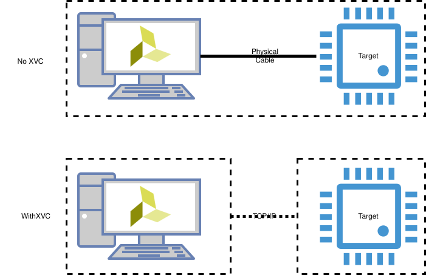

# xvc-rs: Xilinx Virtual Cable in Rust

[](https://github.com/Schottkyc137/xvc-rs/actions/workflows/ci.yml)
[](./LICENSE.txt)
[](https://www.rust-lang.org)

A Rust implementation of the [Xilinx Virtual Cable (XVC) 1.0 protocol](https://github.com/Xilinx/XilinxVirtualCable) for remote JTAG communication with FPGA devices over network connections.

## Disclaimer

This project is an independent implementation of an XVC server. Xilinx® is a registered trademark of AMD. This project is not affiliated with, endorsed by, or supported by AMD or Xilinx.

## What is the Xilinx Virtual Cable (XVC) protocol?

Debugging, programming, or interacting with a target (FPGA, SoC, ...) normally requires a physical JTAG cable connected to the same machine as your tools.

XVC tunnels JTAG over a TCP/IP connection instead.
Tools like Vivado connect to a target elsewhere on the network as if the cable were attached locally, so the host doesn't need physical access to the target or dedicated debug hardware.



## Project Overview

`xvc-rs` is a modular, multi-crate Rust project covering both sides of the XVC
protocol, shipped as both libraries and ready-to-run binaries:

| | Library | Binary |
|-| ------- | ------ |
| **Client** | `xvc-client`, `xvc-protocol` | - |
| **Server** | `xvc-protocol`, `xvc-server` | `xvc-server-debugbridge`, `xvc-server-usb` |

- **Client**: The sending side of the protocol. Mainly useful for testing or for standing in where a tool like Vivado would normally be.
- **Server**: The listening side. AMD Vivado or AMD Vitis typically act as the client, and the server translates incoming calls into the target's JTAG operations.
- **Library**: Crates you depend on via cargo to build custom XVC clients or servers. See the runnable [client](./xvc-client/examples/sample_client.rs) and [server](./xvc-server/examples/mock_server.rs) examples.
- **Binary**: Ready-to-use XVC server executables that need no additional code.

See the READMEs in the respective crates in this repository for more information:

- [xvc-client](./xvc-client/README.md) [](https://crates.io/crates/xvc-client) [](https://docs.rs/xvc-client)
- [xvc-protocol](./xvc-protocol/README.md) [](https://crates.io/crates/xvc-protocol) [](https://docs.rs/xvc-protocol)
- [xvc-server](./xvc-server/README.md) [](https://crates.io/crates/xvc-server) [](https://docs.rs/xvc-server)
- [xvc-server-debugbridge](./xvc-server-debugbridge/README.md) [](https://crates.io/crates/xvc-server-debugbridge)
- [xvc-server-usb](./xvc-server-usb/README.md) [](https://crates.io/crates/xvc-server-usb)

## Quick Start

Which server you run depends on how the target is reached.

### Remote target via USB

The target sits in a controlled environment (e.g., a lab), and a nearby device such as a Raspberry Pi, ESP32, or spare laptop connects to it over USB.
Your PC reaches that device over the network:

```
┌─────────┐            ┌──────────────────────────┐         ┌────────┐
│ Your PC │── TCP/IP ──│ Lab device (Raspberry Pi)│── USB ──│ Target │
└─────────┘            └──────────────────────────┘         └────────┘
```

Install the `xvc-server-usb` binary (the executable is named `xvc-usb`) on the lab device and start it:

```shell
cargo install xvc-server-usb
xvc-usb
```

For more information, read the [xvc-server-usb README](./xvc-server-usb/README.md).

### Target is an FPGA on a SoC

The XVC server can run directly on a SoC (e.g., MPSoC, RFSoC) to debug the FPGA on the same device.
This flow requires zero external hardware, but the FPGA cannot be reconfigured — it is only suitable for ILA or VIO debugging:

```
┌─────────┐            ┌───────────┐                   ┌────────────┐
│ Your PC │── TCP/IP ──│ SoC (CPU) │── memory-mapped ──│ SoC (FPGA) │
└─────────┘            └───────────┘                   └────────────┘
```

Download the `xvc-server-debugbridge` binary (the executable is named `xvc-bridge`) from the [release page](https://github.com/Schottkyc137/xvc-rs/releases?q=xvc-server-debugbridge&expanded=true) and start it on the SoC:

```shell
xvc-bridge
```

This requires the [Xilinx Debug Bridge](https://docs.amd.com/v/u/en-US/pg245-debug-bridge) (or a similar solution) to be instantiated on the target FPGA.
Depending on how that is set up, `xvc-server-debugbridge` offers several modes of operation: the dedicated [kernel driver](https://github.com/Xilinx/XilinxVirtualCable/tree/master/jtag/zynqMP/src/driver), a generic UIO driver, or a raw memory-mapped address.

### Connecting from Vivado

Once a server is running, point Vivado's Hardware Manager at it:

1. Open the **Hardware Manager** and choose **Open Target → Open New Target**.
2. On the **Hardware Server Settings** page, select **Local server** and click **Add Xilinx Virtual Cable (XVC)**.
3. Enter the host running the server and port `2542` (normally pre-selected), then finish the wizard.

The target then appears like a locally attached cable. The same connection can be made from the Tcl console:

```tcl
open_hw_manager
connect_hw_server
open_hw_target -xvc_url <server-host>:2542
```

Vitis uses the same XVC connection settings.
